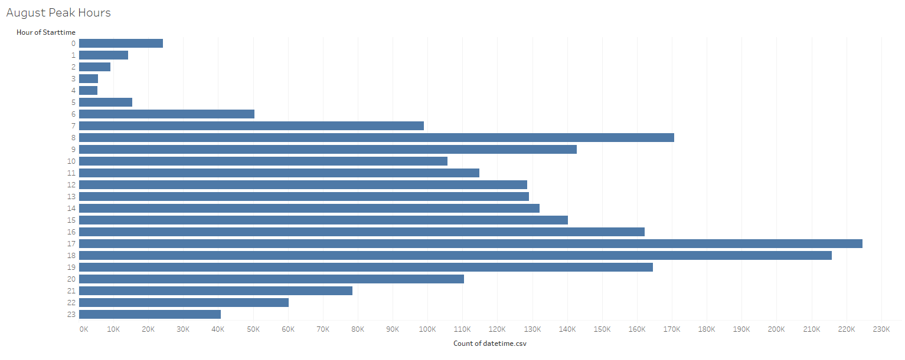
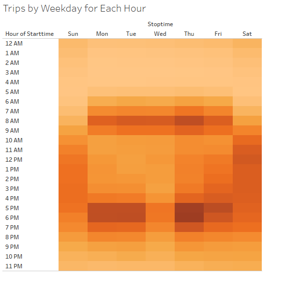
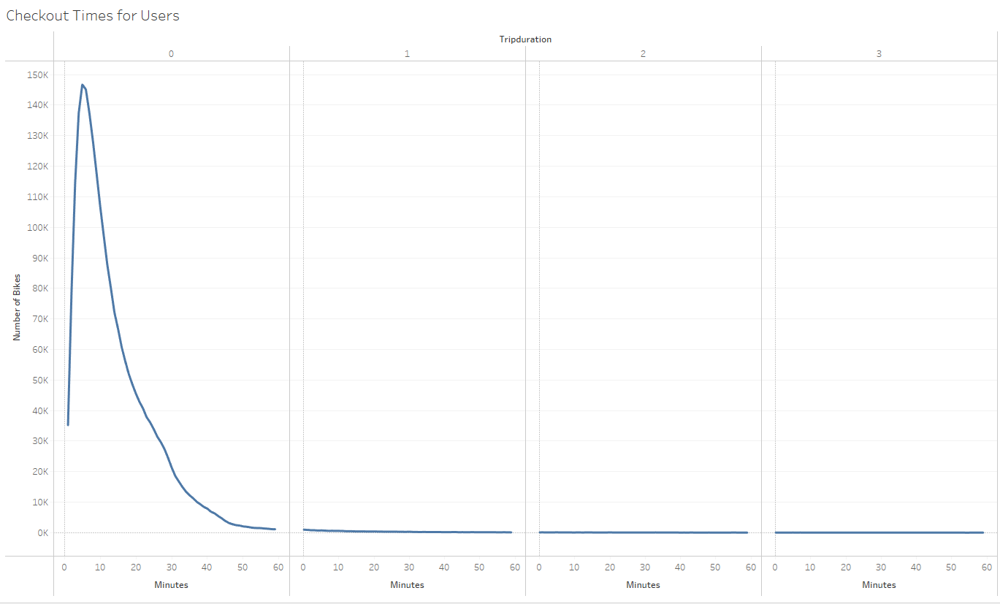
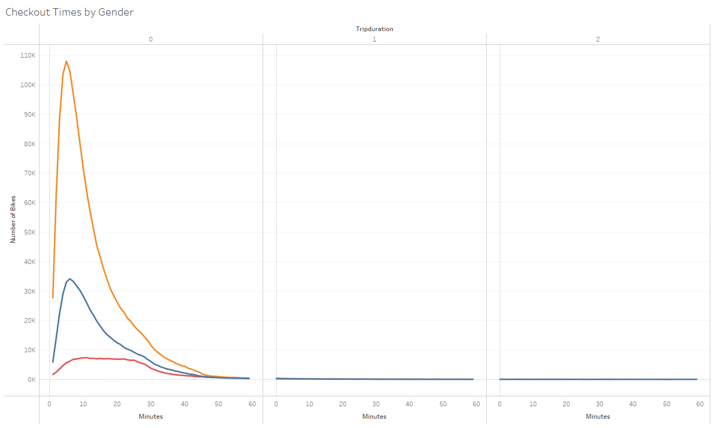
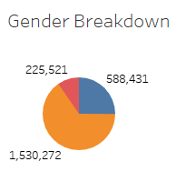
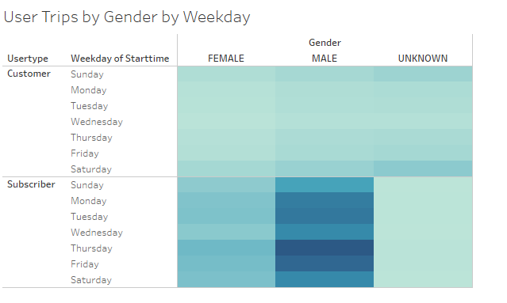
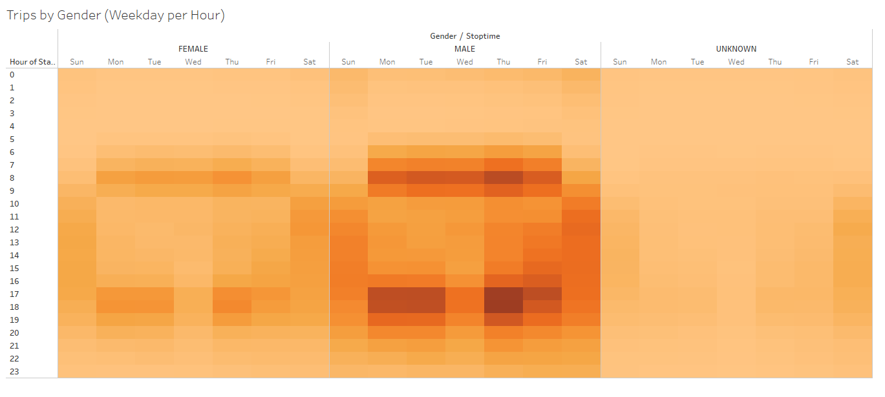

# Citi Bike Overall Analysis
[link to Dashboard](https://public.tableau.com/app/profile/harry5861/viz/Module_14_Challenge_16422864467350/CitiBikeAnalysis?publish=yes)
## Programs Used
-Tableau Public 2021.4

-Pandas

## Purpose and Overview
The purpose of this demonstartion is to review analytic data of Citi Bike Sharing in New York City to assist our client in opening a branch of their own in Des Moines, Iowa. Using Pandas we converted the data in the "tripduration" to a datetime format and exported it back into our folder. The orignal csv, the pandas documentation, and the new csv can all be found in the Resources folder of the repository. Using Tableau we created visual data to more easily inform our investors on the success of bike sharing in other cities and how it could be prioftiable in Des Moine as well. 

## Results

First we looked at the breakdwon of bike usage by hour of the day in the month of August. Being that it is warmer in August and people are more likely to be outside using bikes we figured this was a good month to observe the trends. As the image shows, most of the bikes are used between the hours of 7AM-8AM and 5PM-6PM. It can be concluded that many of these people are using these bikes during commuter hours, possibly to avoid traffic and get home faster in the busy city.

To continue that analysis we broke it down even further to show the times of use not only by the hour but by the days of the week as well. This graph continues to prove out point that the bikes are being used during high traffic commuter hours as the areas with the darkest squares are still the same time frames but during the weekdays as well. The breakdown by days also shows another interesting note that Saturday afternoons appear to be popular for bike rentals, possibly as a recreational activity. 

Next we moved to the average duration of the bike rides by hour and by minutes. The graph shows that most of the bike rides were done within 5 minutes of being checked out, after which we see a steady decline for every minute past five. We can gather that a majority of the bikes sused will not be used for extended periods of time, reducing the the natural wear and tear on the product.

Using that same concept, we decided to not only check the amount of time the bikes were being used but also which gender used them more often. Men exceedingly surpassed woman in bike usage by over three times (108,087 to 34,151 at the five minute mark, respectfully).

From there we wanted to see how many users of the bike sharing were men, women, and unknown. The pie chart shows that men make up 65% of the total demographic of bike share users, with women making up 25% and the unknwon users comprising the remaining 10%.

Once we had collected gender data we decided to repeat some earlier tests to filter by gender to see the differences. When filtering for gender and also by subscriber statuswe can see that men overwhelmingly use bike share program everyday of the week as compared to women or unknown. Also, this graph shows that men and women who are subscribers use bike sharing more often than non-subscribers but the inverse appears to be true for the unknown category. It is possible that the unknown category are using the bikes quickly and are less likely to want to enter personal data as opposed to subscribers. 

Finally we returned to our Weekday per Hour chart, now filtering for gender. Again, we find that we had found earlier continues to be true. Men use the bike share more foten than women and the most popular time to use the bikes are during commuter hours. The men and women charts appear to mirror one another with the main difference being that the men's have darker shading, indicating the higher user counts. 

## Recommendations

This analysis could benefit from expanding it's data to include data from other months. Investors will most likely want to know how this bike sharing fairs in other months to ensure it is still profitable during the colder months and if it not what steps need to be taken to recue costs while the bikes are no longer in use. 
